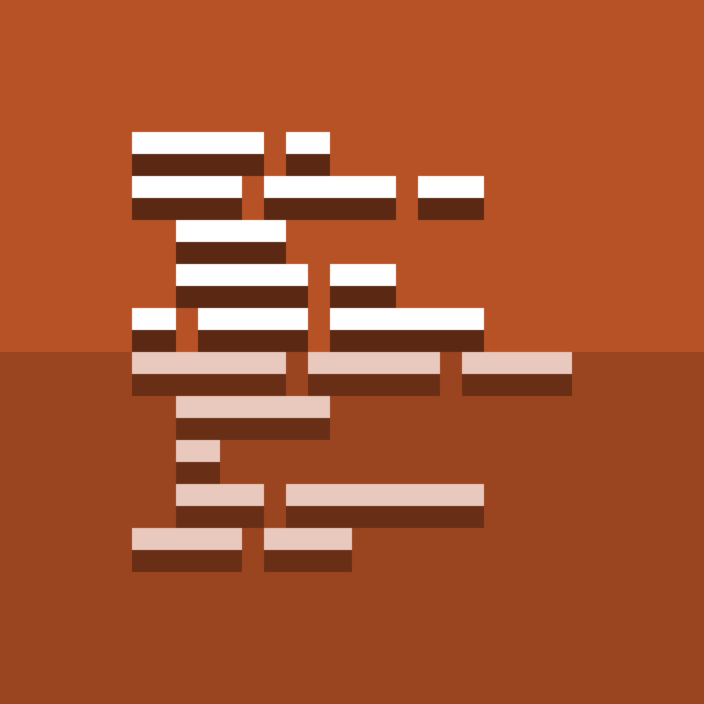

<h1 align="center">
    
     
    HTSL Reborn
     
    
    
     
    
</h1>

## Overview

HTSL Reborn is a fabric mod that makes programming in Hypixel's Housing gamemode easier. With the help of [SystemsAPI](https://github.com/redstone-llc/SystemsAPI), HTSL Reborn ports HTSL's syntax to latest versions, allowing for a seamless switch, and a large possibility for more features to make things work nicer with Housing. To see it in action, check out our [video demo](https://youtu.be/Td826Y_UO48)!

## Features

- [x] Language parity with HTSL (your HTSL scripts will work flawlessly!)
- [x] Importing to Housing
- [x] Exporting to code
- [x] Expressions (Javascript math, etc.)
- [x] Compiler shortcuts (define statements)
- [x] Loops

## Questions

<b>How do I migrate?</b>

To migrate from HTSL to HTSL Reborn, just copy all your imports into the new HTSL folder, located in the root of your minecraft instance. You should be good to go once things have been moved over.
    

<b>What's better about this compared to the ChatTriggers module?</b>

There are a couple of reasons why we abandoned HTSL to make this new mod.
* We wanted to update to the latest version of Minecraft.
* We wanted to leave the ChatTriggers ecosystem.
* We wanted to start fresh with a clean codebase (the old one was starting to get out of hand.)

What does that mean for you?
* Fewer bugs (in the long term)
* latest-version (and multi-version) support
    

<b>I need help!</b>

If you think you may have found a bug, please [create an issue](https://github.com/redstone-llc/HTSLReborn/issues). Otherwise, feel free to join our [discord](https://discord.gg/pCcpqzU4He) or [create a discussion post](https://github.com/redstone-llc/HTSLReborn/discussions).
    

